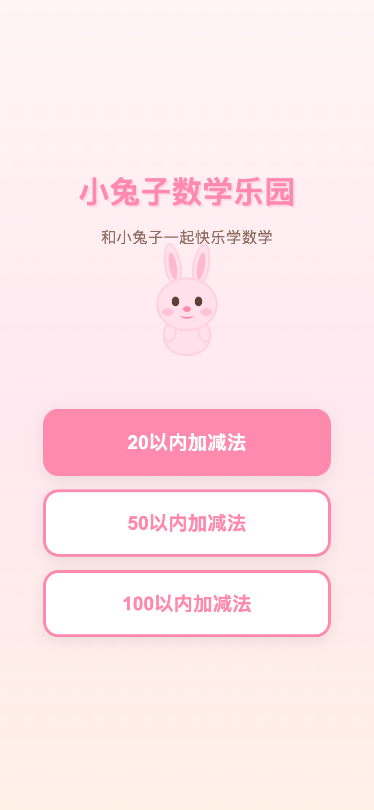
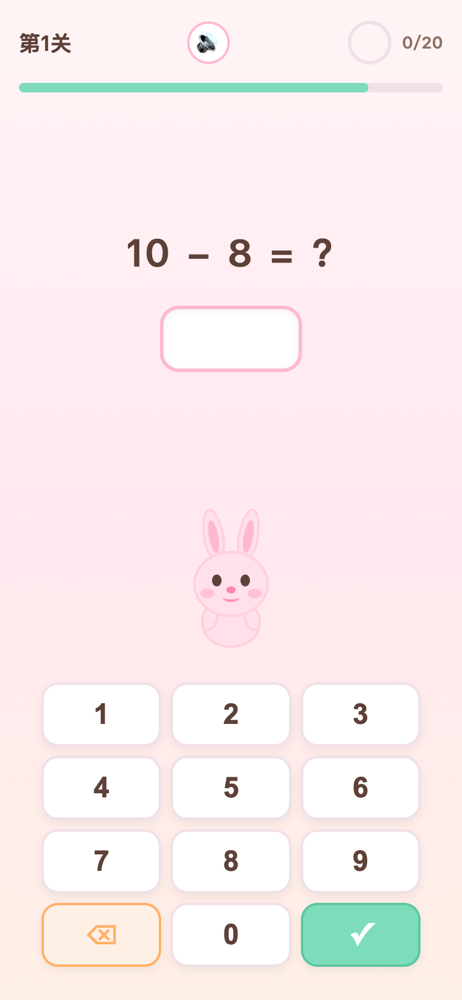
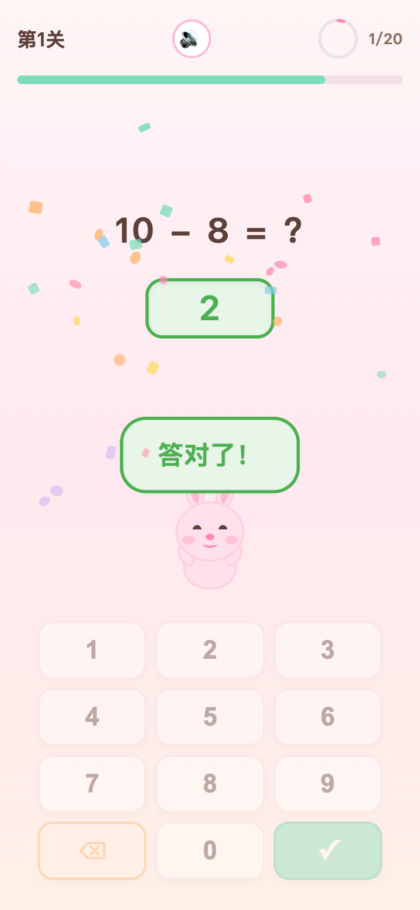
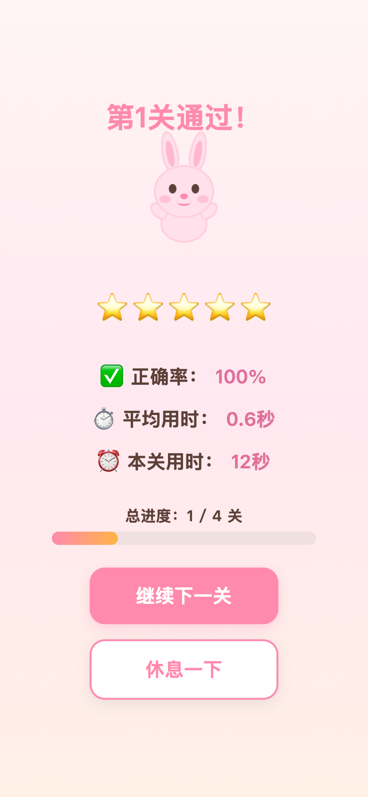
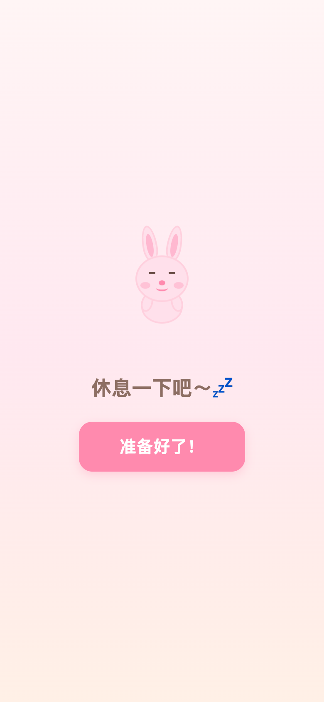

# 🐰 小兔子数学乐园 | Bunny Math Adventure

<p align="center">
  <strong>一款专为6岁小朋友设计的可爱数学练习游戏</strong><br>
  <em>A cute math practice game designed for 6-year-old kids</em><br><br>
  🌐 <a href="https://mathgame.societas.work">mathgame.societas.work</a>
</p>

---

## 📖 项目简介 | About

**小兔子数学乐园**是一款纯前端 H5 数学练习游戏，以可爱的小兔子为主题，通过闯关模式让小朋友在轻松有趣的氛围中练习数学计算。

**Bunny Math Adventure** is a pure front-end H5 math practice game featuring an adorable bunny character. Through a level-based system, children practice math in a fun and engaging way.

### ✨ 特色功能 | Features

- 🎯 **三种难度** — 20以内 / 50以内 / 100以内加减法
- 🧮 **丰富题型** — 加法、减法、进位加法、退位减法、两步连算、三步连算
- 🏰 **闯关模式** — 4关 × 20题 = 每次80题，循序渐进
- 🐰 **CSS小兔子** — 纯CSS绘制的小兔子角色，有开心、伤心、庆祝、睡觉等多种表情
- 🎵 **语音鼓励** — 中文语音实时鼓励，答对表扬、答错安慰
- 🎉 **动画效果** — 彩色纸屑庆祝、星星飘落、进度环等丰富动画
- 📱 **响应式设计** — 手机和平板都能完美使用
- 📊 **学习统计** — 实时显示正确率、用时、进度
- 🔇 **单文件部署** — 无需服务器，一个HTML文件即可运行

---

- 🎯 **Three Difficulty Levels** — Within 20 / 50 / 100 addition & subtraction
- 🧮 **Rich Question Types** — Addition, subtraction, carry addition, borrow subtraction, 2-step & 3-step chained operations
- 🏰 **Level System** — 4 levels × 20 questions = 80 total per session
- 🐰 **CSS Bunny** — Pure CSS-drawn bunny with happy, sad, celebrate, and sleeping expressions
- 🎵 **Voice Encouragement** — Real-time Chinese TTS cheering
- 🎉 **Animations** — Confetti celebrations, falling stars, progress rings
- 📱 **Responsive Design** — Works on phones and tablets
- 📊 **Learning Stats** — Real-time accuracy, timing, and progress display
- 🔇 **Single File** — No server needed, just one HTML file

---

## 📸 游戏截图 | Screenshots

### 🏠 开始页面 | Start Screen
选择难度，准备出发！

Choose your difficulty and get started!

<p align="center">
  
</p>

### 🎮 游戏页面 | Game Screen
可爱的小兔子陪你做数学题，大大的数字键盘方便小朋友输入。

The cute bunny accompanies you through math problems with a large keypad for easy input.

<p align="center">
  
</p>

### ✅ 答对啦 | Correct Answer
答对时彩色纸屑飘落，小兔子开心地跳起来！

Colorful confetti falls and the bunny jumps with joy when you answer correctly!

<p align="center">
  
</p>

### 🏆 关卡完成 | Level Complete
每关结束显示成绩单和总进度，鼓励继续前进。

Level summary shows your stats and overall progress, encouraging you to keep going.

<p align="center">
  
</p>

### 😴 休息一下 | Rest Screen
小兔子困了，提醒小朋友适当休息。

The bunny is sleepy, reminding kids to take a break.

<p align="center">
  
</p>

---

## 🚀 如何使用 | How to Use

### 方法一：直接打开 | Option 1: Open Directly
```
双击 index.html 即可在浏览器中运行
Double-click index.html to run in your browser
```

### 方法二：本地服务器 | Option 2: Local Server
```bash
# Python
python3 -m http.server 8080

# Node.js
npx serve .
```
然后访问 `http://localhost:8080`

Then visit `http://localhost:8080`

### 方法三：在线体验 | Option 3: Play Online
👉 **https://mathgame.societas.work**

无需安装，直接在浏览器中打开即可游玩！

No installation needed — just open in your browser and play!

---

## 🎮 游戏规则 | Game Rules

| 项目 | 说明 |
|------|------|
| 关卡数 | 4关 |
| 每关题数 | 20题 |
| 总题数 | 80题 |
| 答题时间 | 每题15秒 |
| 难度选择 | 20以内 / 50以内 / 100以内 |

| Item | Details |
|------|---------|
| Levels | 4 |
| Questions per level | 20 |
| Total questions | 80 |
| Time per question | 15 seconds |
| Difficulty | Within 20 / 50 / 100 |

**题型说明 | Question Types:**
- ➕ 简单加法 | Simple addition
- ➖ 简单减法 | Simple subtraction
- 🔢 进位加法 | Carry addition
- 🔢 退位减法 | Borrow subtraction
- 📐 两步连算 | 2-step chained (e.g., 3 + 5 - 2)
- 📐 三步连算 | 3-step chained (e.g., 4 + 3 - 1 + 2)

---

## 🛠 技术实现 | Tech Stack

- **纯前端** — 单个 HTML 文件，内嵌 CSS + JavaScript，零外部依赖
- **Web Speech Synthesis API** — 中文语音合成，女声鼓励
- **Web Audio API** — OscillatorNode 生成音效（答对/答错/完成）
- **CSS 动画** — 小兔子角色、彩色纸屑、星星飘落、进度环
- **SVG** — 圆形进度条
- **响应式** — Flexbox 布局，适配手机/平板

---

- **Pure Front-end** — Single HTML file with embedded CSS + JS, zero dependencies
- **Web Speech Synthesis API** — Chinese TTS with female voice encouragement
- **Web Audio API** — OscillatorNode-generated sound effects
- **CSS Animations** — Bunny character, confetti, falling stars, progress ring
- **SVG** — Circular progress bar
- **Responsive** — Flexbox layout for mobile & tablet

---

## 📁 项目结构 | Project Structure

```
math_game/
├── index.html          # 游戏主文件 | Main game file
├── README.md           # 项目说明 | This file
├── screenshots/        # 游戏截图 | Game screenshots
│   ├── 01-start.png
│   ├── 02-game.png
│   ├── 03-correct.png
│   ├── 04-level-complete.png
│   └── 05-rest.png
└── docs/               # 项目文档 | Documentation
    ├── PRD.md          # 产品需求文档 | Product requirements
    ├── DEV.md          # 开发文档 | Development docs
    └── TEST.md         # 测试文档 | Test plan
```

---

## 📄 License

MIT

---

<p align="center">
  用爱为小朋友制作 ❤️ Made with love for kids
</p>
